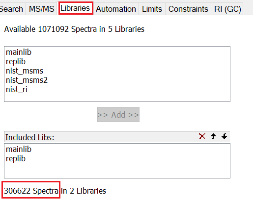

```{r, include = FALSE}
knitr::opts_chunk$set(
  collapse = TRUE,
  comment = "#>",
  eval = FALSE
)
```

```{r setup, include = FALSE}
library(mspcompiler)
```

Here, we will show you in detail how to compile various mass spectral libraries 
into a single, up-to-date, and MS-DIAL friendly library in msp format. This tutorial 
will be divided into two sections explaining the pipeline to process EI and tandem
mass spectral libraries, respectively. To understand each function in detail, 
please use "help or ?", for example,
```{r}
?read_lib
```

## EI libraries
### NIST EI library
NIST is the most commonly used **commercial** EI library. Once you have the 
NIST library installed, you can transformed it into a msp file by *Lib2NIST*. 
Normally *Lib2NIST* will be installed along with the NIST library installation. 
If not, you can download it from https://chemdata.nist.gov/dokuwiki/doku.php?id=chemdata:nist17.
Please use the following settings in *Lib2NIST*:

1. *Add Input Libraries/Files*. For Agilent users, the input file can be found
in, for example, "C:/database/NIST14.L". 

2. Tick *Use Subset* and click *Define Subset* to set detail parameters:

    * Enter which spectra should be exported in *List of Spectra IDs*. 
    
    {width=500px}
     
    * The total number of spectra that your NIST library have can be checked in the *MS Search*
    program (Options -> Libraries -> Add both *mainlib* and *relib*). Then you can
    see the number of spectra your NIST library have.
    
    {width=500px}
   
3. Select "Text File(.MSP) + MOLfiles linked by BOTH" in *Output Format*;

4. Select the library in *Input Libraries or Text Files* and *Convert*.
    {width=500px}

Once you have the \*.MSP file and the correspondent \*.MOL folder exported, you 
can use the following code to add *SMILES* and *Retention Index (RI)*. 

The whole process is time-consuming (several hours, depending on the capability 
of your PC), so we suggests to use parallel computing.

```{r}
library(mspcompiler)
library(future)
library(future.apply)
library(parallel)
# Set up parallel computing. Just remember to set it back once you have the 
# library compiled by "plan(sequential)". We will include it later.
plan(multisession(workers = detectCores() - 1))
```

Below are the code to process NIST EI library assuming that we have all files stored 
in the *MS_libraries* folder in the D disk. You may need to change the path 
accordingly. **Note**: Since the *.MOL folder contains a large number of mol files,
it will be time-consuming to move, copy, or delete this folder. As such, we 
recommend pick up a good location to put this file when you are exporting in 
Lib2NIST, avoiding moving it.
```{r}
# Read the msp file into R.
nist_ei <- read_lib("D:/MS_libraries/NIST.MSP", type = "EI")
# Combine all mol files into a single sdf file for subsequent structure retrieval.
combine_mol2sdf("D:/MS_libraries/NIST.MOL", "D:/MS_libraries/nist.sdf")
# Extract structure based on the sdf file exported before.
nist_ei_structure <- extract_structure("D:/MS_libraries/nist.sdf", "D:/MS_libraries/nist_structure.txt")
# Assign SMILES to the library. If you are working with Linux-based or Mac OS,
# please use "match = "inchikey". 
nist_ei <- assign_smiles(nist_ei, nist_ei_structure, match = "name")
```

### RIKEN EI library
The MS-DIAL developers have compiled an EI library with Kovat RI included.
This library can be downloaded from http://prime.psc.riken.jp/compms/msdial/main.html#MSP.
Please download "All records with Kovats RI...EI-MS..." As it contains Kovats RI,
we can set *remove_ri* to **FALSE** to keep original RI in this file. This file
already have SMILES and InChIKey well-organized. Hence, no further treatment is 
needed.
```{r}
riken_ei <- read_lib("D:/MS_libraries/GCMS DB-Public-KovatsRI-VS3.msp",
                     type = "EI", remove_ri = FALSE)
```

### MoNA EI library
The MassBank of North America (MoNA) has an EI library available for download 
as well, https://mona.fiehnlab.ucdavis.edu/downloads. Please download 
"GC-MS Spectra" in "MSP" form. This file has SMILES information though, it is in
the *Comment* field. Therefore, the SMILES has to be extracted from the *Comment*
and put into the *SMILES* field by the *reorganize_mona* function. 
```{r}
mona_ei <- read_lib("D:/MS_libraries/MoNA-export-GC-MS_Spectra.msp", type = "EI")
mona_ei <- reorganize_mona(mona_ei)
```

### SWGDRUG EI library
The Scientific Working Group for the Analysis of Seized Drugs (SWGDRUG) has 
complied an EI library with drug or drug-related compounds. The library is 
available in https://swgdrug.org/ms.html. The library is available in multiple 
formats. To correctly parse this library by mspcompiler, please download both
**NIST Format** and **Agilent Format**. Then use *Lib2NIST* to convert the 
**NIST Format** into a *msp* file and to transform the **Agilent Format** into 
the *mol* files. Finally, we can read it in a way similar to that used for the
NIST library. 
```{r}
swgdrug_ei <- read_lib("D:/MS_libraries/SWGDRUG.MSP", type = "EI")
combine_mol2sdf("D:/MS_libraries/SWGDRUG.MOL", "D:/MS_libraries/swgdrug.sdf")
swgdrug_ei_structure <- extract_structure("D:/MS_libraries/swgdrug.sdf", "D:/MS_libraries/swgdrug_structure.txt")
# As the SWGDRUG file does not contain InChIKey information, even though you
# are working with Linux-based or Mac OS, you should not use "match = inchikey".
# "match = "name" is more than enough in this case.
swgdrug_ei <- assign_smiles(swgdrug_ei, swgdrug_ei_structure, match = "name")
```

### Combine all libraries
After read in and organize all these libraries, we can now combine them into a
single file, assign experimental RI retrieved from the "ri.dat" and "USER.DBU" files
(if you have NIST library installed).
```{r}
# Combine them
combine_ei <- c(nist_ei, riken_ei, mona_ei, swgdrug_ei)

# Extract experimental RI from the "ri.dat" and "USER.DBU" files. Once you have
# NIST library installed, these files can be found in, for example, 
# "~/Programs/nist14/mssearch/nist_ri". Assuming you have copied these two files
# in the D:/MS_libraries folder, then you will have:
nist_ri <- extract_ri("/D:/MS_libraries/ri.dat", "/D:/MS_libraries/USER.DBU")
# Assign experimental RI to the combined library depending on the column 
# polarity. The polarity can be "semi-polar", "non-polar", or "polar".
# Providing that "capillary" GC columns are commonly used. This
# function will only keep RI records from "capillary" columns and "Lee RI" 
# will be removed. When there are multiple records for a single compound, 
# the median RI will be used and if the standard deviation is higher than 30, 
# this value will be discarded. 
combine_ei <- assign_ri(combine_ei, nist_ri, polarity = "semi-polar")
# At the end, disable parallel computing
plan(sequential)
# Then you can write it out
write_EI_msp(combine_ei, "/D:MS_libraries/combine_ei.msp")
```

## MS2 libraries
```{r}
library(mspcompiler)
library(future)
library(future.apply)
library(parallel)
plan(multisession(workers = detectCores() - 1))
```
MS2 libraries can be processed in a similar way, but positive and negative modes
are normally separated into 2 msp files. 
#### NIST MS2 library 
The NIST MS2 library can be treated as the same as the NIST EI library detailed 
above with only one exception. That is the input file for *Lib2NIST* can be 
found in "C:/Programs/nist14/mssearch/nist_msms". The exported msp file has both
positive and negative modes mixed in a singled file, so we have to separated 
them by the separate_polarity function.
```{r}
nist_ms2 <- read_lib("D:/MS_libraries/NIST_msms.MSP", type = "MS2")
combine_mol2sdf("D:/MS_libraries/NIST_msms.MOL", "D:/MS_libraries/nist_msms.sdf")
nist_ms2_structure <- extract_structure("D:/MS_libraries/nist_msms.sdf", "D:/MS_libraries/nist_msms_structure.txt")
nist_ms2 <- assign_smiles(nist_ms2, nist_ms2_structure, match = "name")
nist_ms2_pos <- separate_polarity(nist_ms2, polarity = "pos")
nist_ms2_neg <- separate_polarity(nist_ms2, polarity = "neg")
```

### RIKEN MS2 libraries
The RIKEN MS2 libraries can be download from the MS-DIAL homepage http://prime.psc.riken.jp/compms/msdial/main.html#MSP. Please download all
public MS/MS positive and negative, separately. 
```{r}
riken_ms2_pos <- read_lib("D:/MS_libraries/MSMS-Public-Pos-VS15.msp")
riken_ms2_neg <- read_lib("D:/MS_libraries/MSMS-Public-Neg-VS15.msp")
```

### MoNA MS2 libraries
The MoNA MS2 libraries can be downloaded from https://mona.fiehnlab.ucdavis.edu/downloads.
Please download "LC-MS/MS Positive Mode" and "LC-MS/MS Negative Mode", separately.
```{r}
mona_ms2_pos <- read_lib("D:/MS_libraries/MoNA-export-LC-MS-MS_Positive_Mode.msp")
# Reorganize the SMILES field.
mona_ms2_pos <- reorganize_mona(mona_ms2_pos)

mona_ms2_neg <- read_lib("D:/MS_libraries/MoNA-export-LC-MS-MS_Negitive_Mode.msp")
mona_ms2_neg <- reorganize_mona(mona_ms2_neg)
```

### GNPS MS2 library
Unlike others, the GNPS library is organized in mgf format, so it has to be
treated differently. Hence, we have to set *format = "mgf"* in the *read_lib*
function. Besides, this library does not have the *Molecular Formula* (MF) field, 
so we can calculated the MF from the SMILES (if it exists) by the *complete_mgf*
function. Finally, both positive and negative modes are in a single file as well.
Therefore, we need to separated the polarity by the *separate_polarity* function 
as well. The GNPS library can be download from https://gnps.ucsd.edu/ProteoSAFe/libraries.jsp.
Please download "All GNPS Library Spectra". 
```{r}
gnps <- read_lib("D:/MS_libraries/ALL_GNPS.mgf", format = "mgf")
# Compute MF
gnps <- complete_mgf(gnps)
gnps_pos <- separate_polarity(gnps, polarity = "pos")
gnps_nge <- separate_polarity(gnps, polarity = "neg")
```

Now we have all MS2 libraries well-organized, so we can combine them.
```{r}
combine_ms2_pos <- c(nist_ms2_pos, riken_ms2_pos, mona_ms2_pos, gnps_pos)
combine_ms2_neg <- c(nist_ms2_neg, riken_ms2_neg, mona_ms2_neg, gnps_nge)
# Disable parallel computing
plan(sequential)
# Then you can write them out separately
write_MS2_msp(combine_ms2_pos, "/D:MS_libraries/combine_ms2_pos.msp")
write_MS2_msp(combine_ms2_neg, "/D:MS_libraries/combine_ms2_neg.msp")
```

### Others
When you have multiple libraries to be read in, for instance if you are building
your in-house library and you have one msp file for each batch of standards, 
then you will have many msp files to combine. The read_multilibs function give 
you an easy way to read all of them at once. In this case, what you need to input
is the folder that contain all these msp files, say the **in_house** folder.
```{r}
in_house <- read_multilibs("D:/MS_libraries/in_house")
```

This package offers ways to remove RI and RT as well. You can use *remove_ri* and
*remove_rt* functions, respectively. For in-house libraries, you might want to 
change meta data, e.g., comment (both EI and MS2 libraries, to add principle 
investigator and data collector for example), collision energy and instrument type
(for MS2 libraries). You can use the *change_meta* function for this purpose.

**Note**:

1. The RIKEN, MoNA, and GNPS MS2 libraries might contains some 
identical spectra as they all compile some well-known libraries. However, it is 
tricky to separate them. This might increase the size of the final msp file, but
should not affect its use. 

2. It takes a long time to process the NIST libraries. For a given lab, it may 
have a particular version of NIST and may not change frequently. For this reason, 
we recommend that once you have NIST libraries organized, save them as .Rda file 
and reuse it the next time. For others, you can check if there is any update 
since your last compilation.
3. All the aforementioned tandem mass spectral libraries are relatively big and 
would consuming rather high amount of memory once they are read into R. If your 
PC does not have enough memory, you can process each library separately, write it 
out as single msp file, and then combine them in a text editor, e.g., Notepad++ 
as the msp file is basically a text file. 
